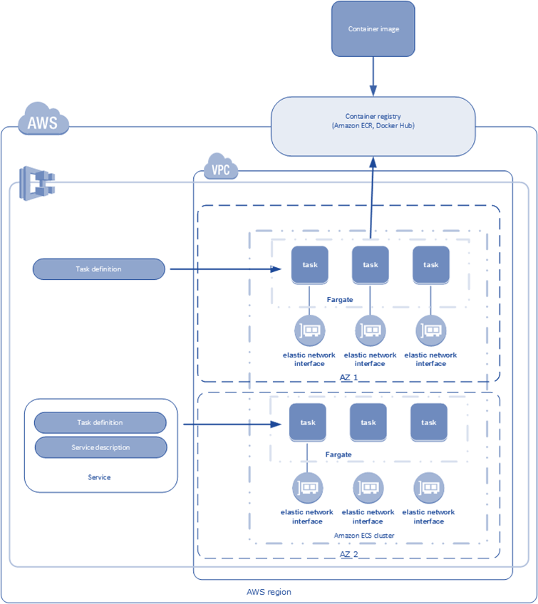

# Create an Amazon ECS Cluster Using Terraform

This project demonstrates how to create an Amazon Elastic Container Service (ECS) cluster using Terraform, an infrastructure-as-code tool. It sets up an ECS cluster with an ECR repository, task definition, and service in the `ap-south-1` region.

## Table of Contents

- [What is Amazon ECS?](#what-is-amazon-ecs)
- [Architecture Overview](#architecture-overview)
- [Prerequisites](#prerequisites)
- [Project Structure](#project-structure)
- [Setup Instructions](#setup-instructions)
- [Verification](#verification)
- [Cleanup](#cleanup)
- [Conclusion](#conclusion)

## What is Amazon ECS?

Amazon ECS is a fully managed container orchestration service that simplifies running, stopping, and managing Docker containers on a cluster. It integrates with AWS services like ECR, ELB, and CloudWatch, abstracting infrastructure management so you can focus on your applications.



## Architecture Overview

Key components of Amazon ECS include:

- **ECS Clusters**: Logical groups of EC2 instances or Fargate containers.
- **Container Instances**: EC2 or Fargate resources hosting containers.
- **Task Definitions**: Blueprints for containers (image, CPU, memory, etc.).
- **Tasks**: Running instances of task definitions.
- **Services**: Manage task scaling and lifecycle.
- **Scheduler**: Places tasks based on resource needs.
- **ECS Agent**: Runs on EC2 instances to communicate with ECS.
- **ELB**: Distributes traffic across containers.
- **CloudWatch**: Monitors performance.
- **ECR**: Stores container images.
- **VPC/ENI**: Provides network isolation and connectivity.

## Prerequisites

- AWS account with IAM credentials.
- AWS CLI configured locally (`aws configure`).
- Terraform installed (version 0.13+ recommended).
- Code editor (e.g., VS Code).

## Project Structure

```
ecs-terraform/
├── provider.tf         # AWS provider configuration
├── vpc.tf             # VPC and subnet setup
├── iam.tf             # IAM role for ECS tasks
├── ecr.tf             # ECR repository
├── taskdefination.tf  # ECS task definition
├── ecs.tf             # ECS cluster
├── service.tf         # ECS service
└── README.md          # This file
```

## Setup Instructions

### Step 1: Create Configuration Files

Save the following content in the respective files:

#### `provider.tf`

```hcl
terraform {
  required_providers {
    aws = {
      source  = "hashicorp/aws"
      version = "~> 5.0"
    }
  }
}

provider "aws" {
  region  = "ap-south-1"
  profile = "default"
}
```

#### `vpc.tf`

```hcl
resource "aws_default_vpc" "ecs-vpc" {
  tags = {
    Name = "ECS-VPC"
  }
}

resource "aws_default_subnet" "ecs_az1" {
  availability_zone = "ap-south-1a"
  tags = {
    Name = "Default subnet for ap-south-1a"
  }
}

resource "aws_default_subnet" "ecs_az2" {
  availability_zone = "ap-south-1b"
  tags = {
    Name = "Default subnet for ap-south-1b"
  }
}

resource "aws_default_subnet" "ecs_az3" {
  availability_zone = "ap-south-1c"
  tags = {
    Name = "Default subnet for ap-south-1c"
  }
}
```

#### `iam.tf`

```hcl
resource "aws_iam_role" "ecsTaskExecutionRole" {
  name               = "ecsTaskExecutionRole"
  assume_role_policy = data.aws_iam_policy_document.assume_role_policy.json
}

data "aws_iam_policy_document" "assume_role_policy" {
  statement {
    actions = ["sts:AssumeRole"]
    principals {
      type        = "Service"
      identifiers = ["ecs-tasks.amazonaws.com"]
    }
  }
}
```

#### `ecr.tf`

```hcl
resource "aws_ecr_repository" "my_first_ecr_repo" {
  name = "my-first-ecr-repo"
  tags = {
    Name = "latest_ecr"
  }
}
```

#### `taskdefination.tf`

```hcl
resource "aws_ecs_task_definition" "my_first_task" {
  family                   = "my-first-task"
  container_definitions    = <<DEFINITION
[
  {
    "name": "my-first-task",
    "image": "${aws_ecr_repository.my_first_ecr_repo.repository_url}",
    "essential": true,
    "portMappings": [
      {
        "containerPort": 80,
        "hostPort": 80
      }
    ],
    "memory": 512,
    "cpu": 256,
    "networkMode": "awsvpc"
  }
]
  DEFINITION
  requires_compatibilities = ["EC2"]
  network_mode             = "awsvpc"
  memory                   = 512
  execution_role_arn       = aws_iam_role.ecsTaskExecutionRole.arn
  cpu                      = 256
}
```

#### `ecs.tf`

```hcl
resource "aws_ecs_cluster" "my_cluster" {
  name = "my-ecs-cluster"
}
```

#### `service.tf`

```hcl
resource "aws_ecs_service" "my_first_services" {
  name              = "gft-test-first-services"
  cluster           = aws_ecs_cluster.my_cluster.id
  task_definition   = aws_ecs_task_definition.my_first_task.arn
  launch_type       = "EC2"
  scheduling_strategy = "REPLICA"
  desired_count     = 1

  network_configuration {
    subnets          = [aws_default_subnet.ecs_az1.id]
    assign_public_ip = false
  }
}
```

### Step 2: Deploy the ECS Cluster

1. **Initialize Terraform**:

   ```bash
   terraform init
   ```

   Downloads the AWS provider plugin.

2. **Plan the Deployment**:

   ```bash
   terraform plan
   ```

   Review the resources to be created.

3. **Apply the Configuration**:

   ```bash
   terraform apply -auto-approve
   ```

   Creates the ECS cluster, ECR repository, task definition, and service.

   

### Notes

- The task definition references an ECR image (`my-first-ecr-repo`). You must push an image to this repository manually before the service can run successfully. Example:
  ```bash
  aws ecr get-login-password --region ap-south-1 | docker login --username AWS --password-stdin <ecr_repo_url>
  docker tag my-image:latest <ecr_repo_url>:latest
  docker push <ecr_repo_url>:latest
  ```
- EC2 instances are required for the `EC2` launch type but aren’t provisioned here. Add an EC2 Auto Scaling group if needed.

## Verification

- Check AWS Console:
  - ECS > Clusters > `my-ecs-cluster`.
  - Verify the service (`gft-test-first-services`) and task are running.
  - ECR > Repositories > `my-first-ecr-repo`.

## Cleanup

- Destroy resources:
  ```bash
  terraform destroy -auto-approve
  ```

## Conclusion

This Terraform setup automates the creation of an ECS cluster in `ap-south-1`. It provides a repeatable, consistent way to manage containerized applications on AWS. Extend this by adding EC2 instances, load balancers, or Fargate support as needed.

For more details, see the [AWS ECS documentation](https://docs.aws.amazon.com/AmazonECS/latest/developerguide/Welcome.html) or [Terraform AWS Provider](https://registry.terraform.io/providers/hashicorp/aws/latest/docs).

---

### Notes for Use

- **EC2 Requirement**: The `EC2` launch type requires running EC2 instances in the cluster. This configuration assumes you’ll add them separately or have existing instances registered.
- **Image**: The task definition needs a valid container image in ECR. Push one manually after deployment.
- **Permissions**: Ensure your AWS credentials (`default` profile) have ECS, ECR, IAM, and VPC permissions.
